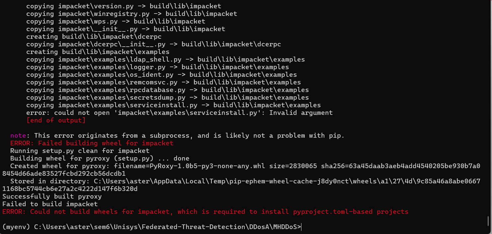
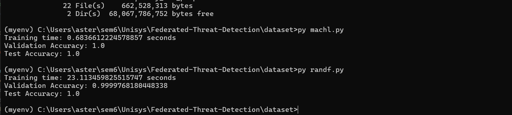
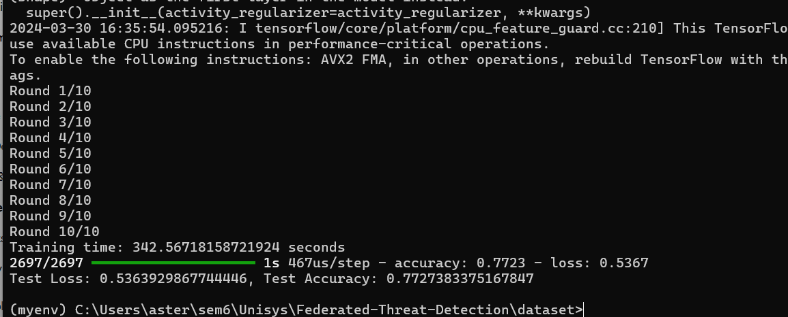
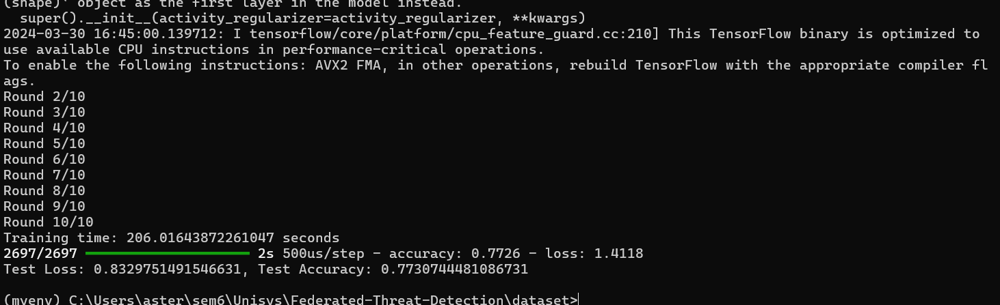
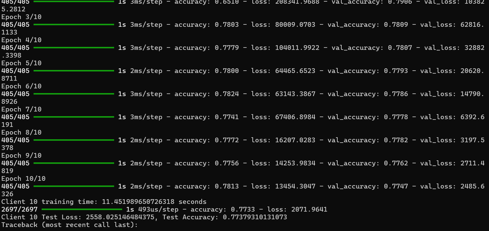
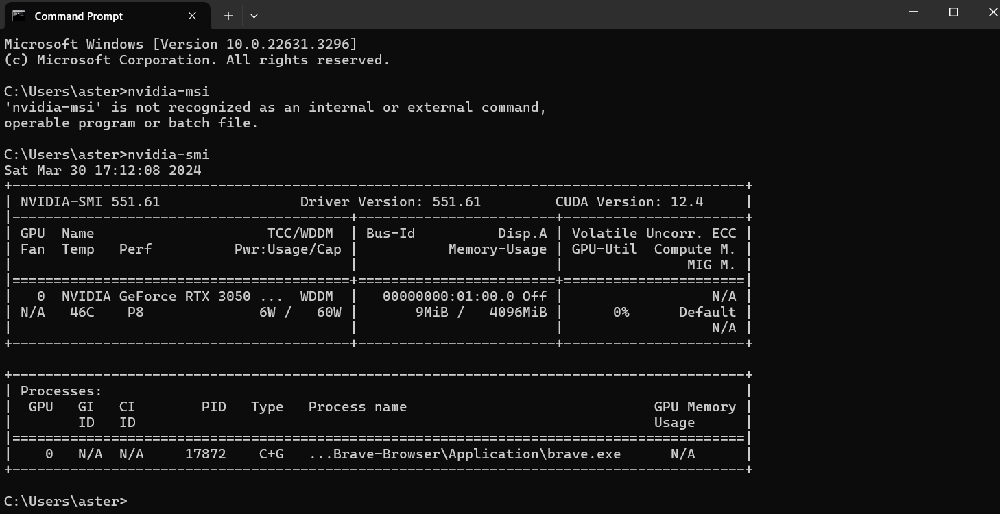

# Federated-Threat-Detection
The project aims to expedite the training of deep learning models for log analysis and monitoring, critical for cybersecurity and threat detection.

# Abstract:
This project proposes a comprehensive solution to expedite the training of deep learning models for log analysis and monitoring, crucial for cybersecurity and threat detection. Leveraging parallel processing techniques, log and monitoring data stored in vector databases are efficiently processed, providing invaluable insights into potential security breaches. However, traditional training methods can be time-consuming, hindering timely threat response. To address this, federated learning is introduced to facilitate distributed model training, allowing for collaborative learning across multiple nodes without compromising data privacy. In cases where infrastructure limitations hinder federated learning implementation, an AI adaptive GPU switch mechanism is employed to optimize computational resources. This trade-off between federated learning and GPU optimization ensures rapid model updates, enabling real-time threat prevention by keeping the system continuously responsive to emerging threats worldwide.

# Introduction
The cybersecurity landscape has evolved a lot over the past few years. We have had great strides of improvement but the other side has well. It has come to a point where AI is used to create highly sophisticated malware. We can’t stay as we are and hope to secure our systems with the attacks that are going to occur.

[2019–2023 in Review: Projecting DDoS Threats With ARIMA and ETS Forecasting Techniques | IEEE Journals & Magazine | IEEE Xplore](https://ieeexplore.ieee.org/document/10439150)

The above paper takes a review on the global DDos attacks and has put forth a forecast of attacks that will occur in 2024-2026 and these attacks are predicted to cause substantial economic damages. The community is aware of the unstable situation we are in and we need to up our AI powered security measures to stand what is coming.

# Architecture Design


# Developer logs

Setup the virtual environment:

```bash
pip install virtualenv

python -m venv myenv
```

### To activate virtual environment

```bash
myenv\Scripts\activate
```
You would now have a (myenv) before the directory mentioned in your terminal pointing out that the environment is virtual.

## Install FastAPI and Uvicorn

Uvicorn is used for ASGI server implementation.

```bash
pip install fastapi uvicorn
```

To run site in developement mode. Reload is used to update site after the code is changed.

```bash
uvicorn main:app --reload
```

Open link at:
```link
http://127.0.0.1:8000/api/data
```
Had setup react app, go to frontend/threat-detector folder and run
```bash
npm start
```
The data from fastapi will now be directed to react to display.

### To start InfluxDB server

```bash
cd -Path 'C:\Program Files\InfluxData\influxdb'
```

```bash
./influxd
```
### To setup Material UI

```bash
 npm install @mui/material @emotion/react @emotion/styled
```

### Setting up federated learning framework

installed flwr

### Dataset info

Took the dataset from

https://data.mendeley.com/datasets/ssnc74xm6r/1

Original source:
https://www.unb.ca/cic/datasets/ddos-2019.html

### Splitting dataset into 3 parts

For example, if you have 1000 samples in your dataset, you might split it as follows:

700 samples for training (70%)
150 samples for validation (15%)
150 samples for testing (15%)

### Running the deep learning model


The accuracy is 77 percent with time taken to train the model being 38 seconds.

### Setting up the attack method for the demo

Using a https://github.com/Ha3MrX/DDos-Attack ddos attack python script file from github.

That didn't work as it needed python 2.x based on the syntax given so we will switch to a different method.

Let's try the one with most stars on the github.

git clone https://github.com/MHProDev/MHDDoS.git



Failed to build impact with MHDDos tool. Onto next tool.

Raven-storm works for ddos and stress testing after resolving requests module upgrade issue.

https://github.com/Tmpertor/Raven-Storm

### Setting up DEMO

Go to cd DEMO and CD dummysite 

```bash
python -m http.server 8000
```

Now go to dummyddos and run

```bash
python main.py
```

Decided to use flask web server to limit the resources used to bring about the denial of service to the web page.

Go to dummysite and run

```bash
python main.py
```
To get the webserver running.

Go to DDosA\Raven-Storm and run

```bash
python main.py
```
then go to l7 and set targets

```bash
targets http://127.0.0.2:5000/, http://127.0.0.2:5000/about, http://127.0.0.2:5000/services, http://127.0.0.2:5000/contact
```
Now type run

```bash
run
```
Say Y when prompted to continue.

Use Ctrl+C to stop the attack.

Observe the denial of service on the website on the local machine due to a lot requests.

### Building data pipeline to receive data in .csv format

We use wireshark currently to get the data we require in the local environment.

We could use scapy we need ethernet interface data.

we run

```bash
python capture.py
```

To get that data.

For wireshark data export data into .csv

The we preprocess that into right tables and calculate some derivative values using

```bash
python preprocess.py
```

### Decision tree and random forest to append attack or begnin to row



Here, we have the random forest model with accuracy 99 percent as the data was already arranged well with training time of 23 seconds.

### Simulated federated learning done



Here, this is the total time after every client has run through.

But, what we have to focus on is that all the clients would run parallely rather than sequencially.



This is after using multithreading. We are at 203 seconds.



Here, I just need to find the training time of 1 client and it averages to 10 seconds per client. Significant improvement. Compared to taking 38 seconds on normal deep learning models, we have reduced the training time.

So, the improvement in training time is approximately 
73.68%

### Setting up GPU drivers and CUDA



Have cuda on my system to use for AI computations after os incompatibility issues.

```bash
nvidia-smi
```
Type the above command in terminal to see the info.

### Using Google Colab to run the GPU computations


The time taken using CPU for data processing.


After better preprocessing, we have a training time of 223 seconds and accuracy of 98%.


That was a dud with tensorflow gpu.


Was able to bring up the accuracy, the training time went down tho.

The complex model takes more time and have less accuracy of 77%


This is good. We are increasing the batch size as GPU can handle tho better leading to a quicker trained models. Accuracy is less but the trade off is less training time.


Increasing the batch size so we can compute even faster.


Similar results again.


Conclusively, as the data density decreases the accuracy is decreased.

Hence, using GPU for processing in distributed deep learning leads to reduced training time.
So, the percentage reduction in training time is approximately 80.72%.
Also, the decrease in accuracy is 20%. The reason accuracy decreases is because the density of the data decreases, if we take the proper monitoring data sources, the density would remain better and hence better accuracy as a result.

## Prevention using Runtime Application Self Protection

We would at last integrate a RASP module with the modal we have trained on to prevent the attacks from occuring again.


